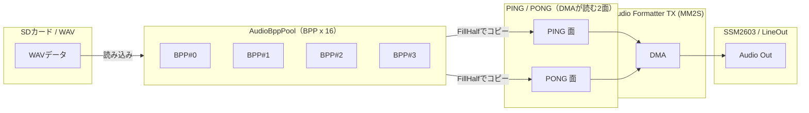
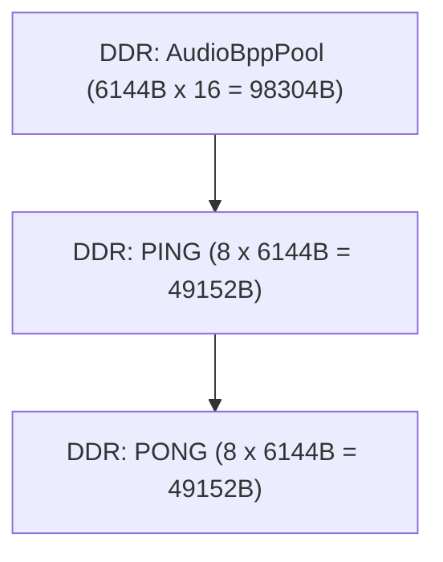
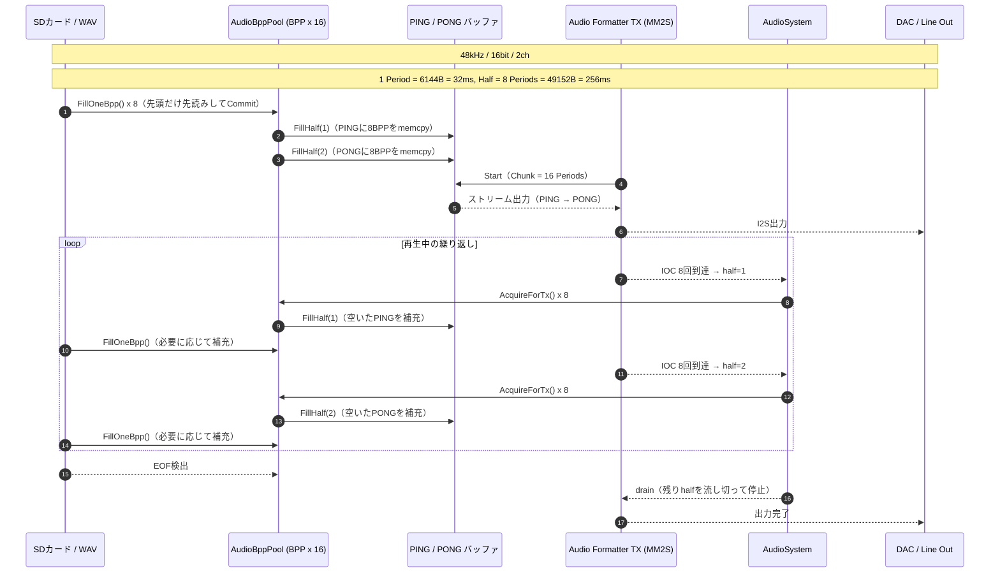
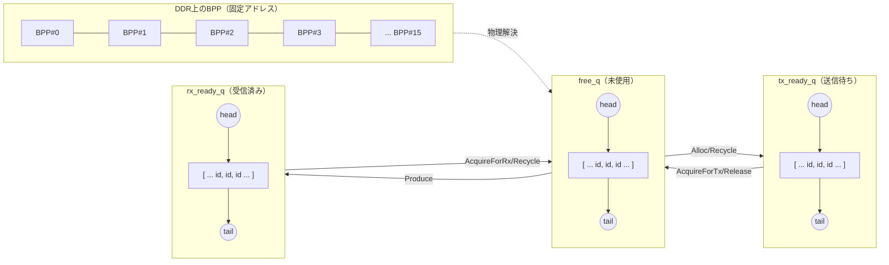

## データフロー（SD → プール → PING/PONG → DMA → CODEC）

```mermaid
flowchart LR
  subgraph SD["SDカード / WAV"]
    A[WAVデータ]
  end

  subgraph POOL["AudioBppPool（BPP x 16）"]
    P0[BPP#0]
    P1[BPP#1]
    P2[BPP#2]
    P3[BPP#3]
  end

  subgraph RING["PING / PONG（DMAが読む2面）"]
    R1[PING 面]
    R2[PONG 面]
  end

  subgraph AF["Audio Formatter TX (MM2S)"]
    D[DMA]
  end

  subgraph CODEC["SSM2603 / LineOut"]
    C[Audio Out]
  end

  A -->|読み込み| POOL
  POOL -->|FillHalfでコピー| R1
  POOL -->|FillHalfでコピー| R2
  R1 --> D
  R2 --> D
  D --> C
```

## DDRメモリ配置（上:プール → PING → PONG）

```mermaid
flowchart TB
  M0["DDR: AudioBppPool (6144B x 16 = 98304B)"]
  M1["DDR: PING (8 x 6144B = 49152B)"]
  M2["DDR: PONG (8 x 6144B = 49152B)"]

  M0 --> M1 --> M2
```

## オーディオ再生の時間的流れ

```mermaid
sequenceDiagram
    autonumber
    participant SD as SDカード / WAV
    participant Pool as AudioBppPool (BPP x 16)
    participant PingPong as PING / PONG バッファ
    participant DMA as Audio Formatter TX (MM2S)
    participant App as AudioSystem
    participant Codec as DAC / Line Out

    Note over SD,Codec: 48kHz / 16bit / 2ch
    Note over SD,Codec: 1 Period = 6144B = 32ms, Half = 8 Periods = 49152B = 256ms

    %% 初期先読み（全量ではなく一部だけ）
    SD->>Pool: FillOneBpp() x 8（先頭だけ先読みしてCommit）
    Pool->>PingPong: FillHalf(1)（PINGに8BPPをmemcpy）
    Pool->>PingPong: FillHalf(2)（PONGに8BPPをmemcpy）

    %% 再生開始
    DMA->>PingPong: Start（Chunk = 16 Periods）
    PingPong-->>DMA: ストリーム出力（PING → PONG）
    DMA-->>Codec: I2S出力

    %% 再生中は並行して補充が続く
    loop 再生中の繰り返し
        DMA-->>App: IOC 8回到達 → half=1
        App->>Pool: AcquireForTx() x 8
        Pool->>PingPong: FillHalf(1)（空いたPINGを補充）
        SD->>Pool: FillOneBpp()（必要に応じて補充）

        DMA-->>App: IOC 8回到達 → half=2
        App->>Pool: AcquireForTx() x 8
        Pool->>PingPong: FillHalf(2)（空いたPONGを補充）
        SD->>Pool: FillOneBpp()（必要に応じて補充）
    end

    %% 終了処理
    SD-->>Pool: EOF検出
    App-->>DMA: drain（残りhalfを流し切って停止）
    DMA-->>Codec: 出力完了
```

## プール

```mermaid
flowchart LR
  subgraph DDR["DDR上のBPP（固定アドレス）"]
    direction LR
    B0["BPP#0"] --- B1["BPP#1"] --- B2["BPP#2"] --- B3["BPP#3"] --- Bn["... BPP#15"]
  end

  subgraph QFREE["free_q（未使用）"]
    Fh(("head")) --> FQ["[ ... id, id, id ... ]"] --> Ft(("tail"))
  end
  subgraph QTX["tx_ready_q（送信待ち）"]
    Th(("head")) --> TQ["[ ... id, id, id ... ]"] --> Tt(("tail"))
  end
  subgraph QRX["rx_ready_q（受信済み）"]
    Rh(("head")) --> RQ["[ ... id, id, id ... ]"] --> Rt(("tail"))
  end

  DDR -. 物理解決 .-> QFREE
  QFREE -- Alloc/Recycle --> QTX
  QTX -- AcquireForTx/Release --> QFREE

  QFREE -- Produce --> QRX
  QRX -- AcquireForRx/Recycle --> QFREE
```
