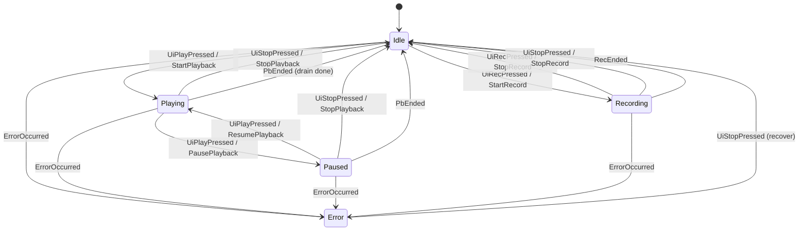

```mermaid
stateDiagram-v2
  [*] --> Idle

  Idle --> Playing: UiPlayPressed / StartPlayback
  Idle --> Recording: UiRecPressed / StartRecord
  Idle --> Error: ErrorOccurred

  Playing --> Paused: UiPlayPressed / PausePlayback
  Paused --> Playing: UiPlayPressed / ResumePlayback

  Playing --> Idle: UiStopPressed / StopPlayback
  Paused --> Idle: UiStopPressed / StopPlayback

  Playing --> Idle: PbEnded (drain done)
  Paused --> Idle: PbEnded
  Recording --> Idle: UiRecPressed / StopRecord
  Recording --> Idle: UiStopPressed / StopRecord
  Recording --> Idle: RecEnded

  Playing --> Error: ErrorOccurred
  Paused --> Error: ErrorOccurred
  Recording --> Error: ErrorOccurred

  Error --> Idle: UiStopPressed (recover)
```
