# ソフトウェア基本設計書

## 1. 概要

### 1-1. システム概要
- 本ソフトは、音声再生・録音・設定操作を実現するAMP構成アプリケーションである。
- Core0が音声I/Oとストレージ処理、Core1がUIと入力処理を担当する。

## 2. 目的

- 本書は VoiceNote（`voice_note_app_amp0` / `voice_note_app_amp1`）のソフトウェア基本設計を定義する。

## 3. 用語

### 3-1. 用語
| 用語 | 正式名称 | 意味 |
|------|----------|------|
| AMP | Asymmetric Multi-Processing | 2コアで役割分担して動かす構成（Core0=音声処理、Core1=UI）。 |
| IPC | Inter-Processor Communication | コア間でコマンド/状態をやり取りする仕組み。 |
| OCM | On-Chip Memory | SoC内蔵メモリ。ここではIPC共有領域として使う。 |
| DMA | Direct Memory Access | CPU介在を減らしてデータ転送する仕組み。 |
| GIC | Generic Interrupt Controller | 割り込みの受付・振り分けを行うコントローラ。 |
| Audio Formatter | AXI Audio Formatter IP | PL側の音声DMA IP（MM2S/S2MM）で、DDRとI2S系の橋渡しを行う。 |
| MM2S | Memory-Mapped to Stream | メモリからストリームへ送る方向（再生系）。 |
| S2MM | Stream to Memory-Mapped | ストリームからメモリへ取り込む方向（録音系）。 |
| SPSC | Single Producer Single Consumer | 送信者1・受信者1のリングバッファ方式。 |
| BPP | Buffer Per Period | period単位の固定長オーディオバッファ。 |

## 4. 全体構成

### 4-1. 全体構成図
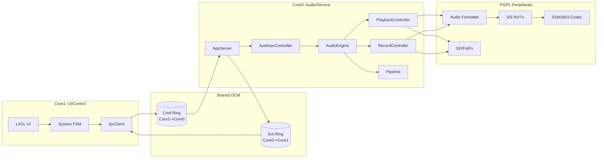

### 4-2. 機能一覧
| 機能 | 概要 | 主担当コア | 主モジュール |
|------|------|------------|--------------|
| 再生 | WAV読込〜DMA送出〜I2S出力 | Core0 | `PlaybackController`, `AudioFormatterTx`, `I2sTx` |
| 録音 | I2S入力〜DMA受信〜WAV保存 | Core0 | `RecordController`, `AudioFormatterRx`, `I2sRx` |
| 録再状態管理 | 再生/録音の状態遷移制御 | Core0 | `AudioEngine`, `AudioFsm` |
| UI表示/操作 | 画面描画、タッチ入力、状態表示 | Core1 | `LvglController`, `System`, screen群 |
| コア間通信 | コマンド送受信、状態通知 | Core0/Core1 | `AppServer`, `IpcClient`, `mailbox` |
| ファイル一覧 | SD内WAV列挙 | Core0（処理）/Core1（表示） | WAV一覧取得処理, playlist UI |
| AGC設定 | UI設定値の適用 | Core1→Core0 | `IpcClient::SetAgc`, `AudioIpcController::on_set_agc` |

### 4-3. コア役割分担
| 機能 | Core0 | Core1 | 備考 |
|------|-------|-------|------|
| Audio録音 | ○ | - | Audio Formatter RX, I2S RX, SD書き込み |
| Audio再生 | ○ | - | Audio Formatter TX, I2S TX, SD読み出し |
| GUI描画 | - | ○ | LVGL画面制御 |
| 操作入力 | - | ○ | タッチ/GPIO入力 |
| SDアクセス | ○ | - | FatFs mount/unmount含む |
| IPCサーバ | ○ | - | Cmd受信・Evt送信 |
| IPCクライアント | - | ○ | Cmd送信・Evt受信 |
| Logging | ○ | ○ | UARTログ |

### 4-4. 起動シーケンス
- Core0が先行起動し、OCM共有領域とGICディストリビュータを初期化する。
- Core0が共有IPC領域（magic/version、リングhead/tail）を初期化する。
- Core0がCPU1ブートベクタ（`0xFFFFFFF0`）へ開始アドレスを書き、`sev`でCore1を起床する。
- Core1は共有メモリへ接続し、UI/入力/IPCクライアントを初期化してメインループへ入る。

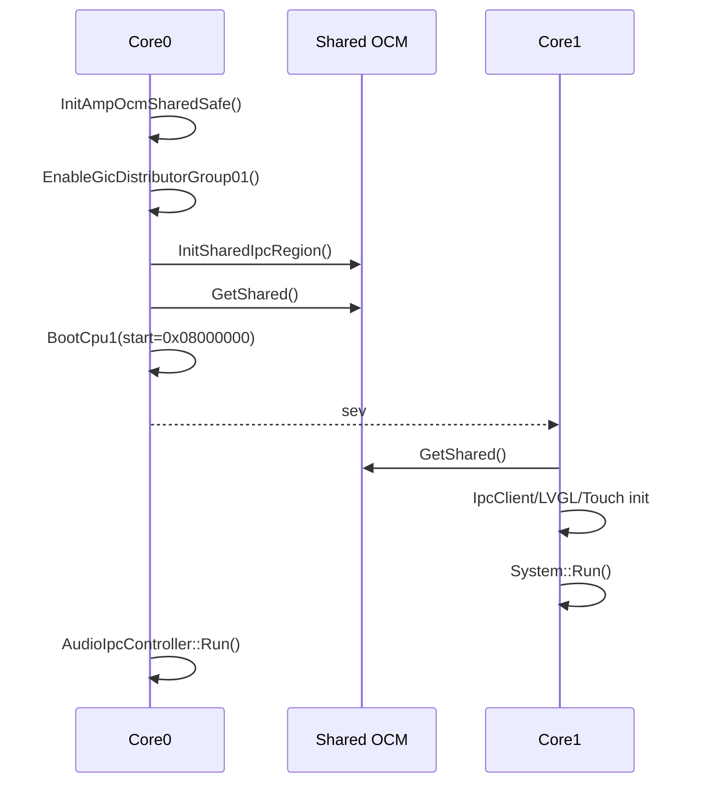

### 4-5. I/F一覧（外部・ハードウェア）
| I/F名 | 接続先 | 使用コア | 用途 | 速度/モード | 備考 |
|------|--------|----------|------|------------|------|
| I2C (XIIC_0) | SSM2603 Codec | Core0 | Codec設定（初期化/ゲイン等） | 標準モード（詳細は詳細設計） |  |
| I2C (XIIC_1) | Touch Controller | Core1 | タッチデバイス制御 | 標準モード（詳細は詳細設計） | |
| SPI (XSPIPS_0) | LCDパネル | Core1 | 画面転送/描画制御 | SPIモード（詳細は詳細設計） | UI表示系 |
| GPIO (XGPIO_0) | Board I/O | Core0 | ボタン/LED等 | GPIO | デバッグ用途。IRQ使用あり |
| GPIO (XGPIO_1) | Touch IRQ入力 | Core1 | タッチ割り込み入力 | GPIO | IRQ使用あり |
| GPIO (XGPIOPS_0) | LCD制御ピン | Core1 | LCD制御信号 | GPIO | リセット/CS等の制御用 |
| SDIO/FatFs | SDカード | Core0 | WAV読込/保存 | SDIO + FAT | Core0が排他管理 |
| UART | Host PC/Console | Core0/Core1 | ログ出力 | UART（設定はBSP準拠） | `LOG*` 出力 |
| Shared OCM (IPC) | Core0 <-> Core1 | Core0/Core1 | Cmd/Evt通信 | SPSC Ring, 128B/msg | ロック機構を使わないhead/tail更新 + `dmb()` |

## 5. モジュール構成

### 5-1. モジュール一覧
| モジュール | コア | 役割 |
|-----------|------|------|
| `AudioIpcController` | Core0 | IPCコマンドと音声ユースケース仲介 |
| `AppServer` | Core0 | Cmd受信、Ack/Error/Status送信 |
| `AudioEngine` | Core0 | 再生/録音状態遷移と実行管理 |
| `PlaybackController` | Core0 | WAV再生（SD→バッファ→AudioFmt TX） |
| `RecordController` | Core0 | 録音（AudioFmt RX→SD） |
| `Pipeline` | Core0 | Audio HW一括初期化（Codec/AF/ACU） |
| `IpcClient` | Core1 | Cmd送信・Evt受信 |
| `System` | Core1 | UIイベント・IPCイベント統合FSM |
| `LvglController` | Core1 | 画面描画/遷移/入力反映 |

※基本設計では主要モジュールのみを記載し、責務境界と依存方向を定義する。全モジュールの網羅一覧は詳細設計で定義する。

### 5-2. 依存関係
- Core1 UIはCore0ドライバを直接操作しない。必ずIPC経由。
- Core0はUI状態を保持しない。再生/録音状態はIPCイベントで通知。

### 5-3. プロジェクト構成
```text
・/
├─ from_hw/                     # xsa（Vivado生成物）
│  └─ design_1_wrapper.xsa
├─ voice_note_app_amp0/         # Core0アプリ（音声処理/IPCサーバ）
│  ├─ src/
│  └─ build/
├─ voice_note_app_amp1/         # Core1アプリ（UI/IPCクライアント）
│  ├─ src/
│  └─ build/
├─ liblvgl/                     # LVGLライブラリ
│  ├─ src/
│  └─ build/
├─ voice_note_platform/         # BSP/HW定義/FSBL等のプラットフォーム資産
│  ├─ hw/
│  ├─ ps7_cortexa9_0/
│  ├─ ps7_cortexa9_1/
│  └─ zynq_fsbl/
└─ voice_note_sys/              # 統合管理（doc/build/output）
   ├─ build/
   └─ output/
```

### 5-4. アドレスマップ

#### 5-4-1. ベースアドレス
| 区分 | 論理名 | アドレス値 | 主用途 |
|------|--------|------------|--------|
| Core0 | Audio Formatter | `0x43C40000` | MM2S/S2MM DMA制御 |
| Core0 | I2S RX | `0x43C00000` | 録音入力 |
| Core0 | I2S TX | `0x43C10000` | 再生出力 |
| Core0 | I2S Clock Mux | `0x43C20000` | RX/TXクロック切替 |
| Core0 | PL I2C | `0x43C30000` | Codec制御 |
| Core0 | PL GPIO | `0x43C90000` | ボタン/LED |
| Core0/Core1 | GIC | `0xF8F01000` | 割り込み制御 |
| Core1 | SPI PS | `0xE0007000` | LCDバス |
| Core1 | GPIO PS | `0xE000A000` | LCD制御ピン |
| Core1 | PL GPIO | `0x43C60000` | タッチIRQ入力 |
| Core1 | PL I2C | `0x43C50000` | タッチI2C |
| 共通 | Shared OCM Base | `0xFFFC2000` | IPC共有領域 |
| 共通 | CPU1 Vector | `0xFFFFFFF0` | Core1起動ベクタ |
| 共通 | DMA Buffer Base | `0x10000000` | Audio DMAバッファ |

## 6. 状態遷移設計

### 6-1. 対象と記載範囲
- 本章は、主要コンポーネントの状態と主要遷移のみを定義する。
- 実装イベントの詳細条件、エラー分岐の細部、ハンドラ処理順は詳細設計で定義する。

### 6-2. 対象コンポーネント概要
| コンポーネント | コア | 役割 | 状態遷移対象 |
|---------------|------|------|--------------|
| `AudioEngine` | Core0 | 再生/録音の実行状態を管理 | `Idle / Playing / Paused / Recording` |
| `System` | Core1 | UI操作とIPCイベントを統合して画面状態を管理 | `Idle / Playing / Paused / Recording` |
| `IPC(1コマンド単位)` | Core0/Core1 | コマンド要求と応答の進行を管理 | `Sent / Accepted / Done / Error` |

### 6-3. AudioEngine FSM（Core0）
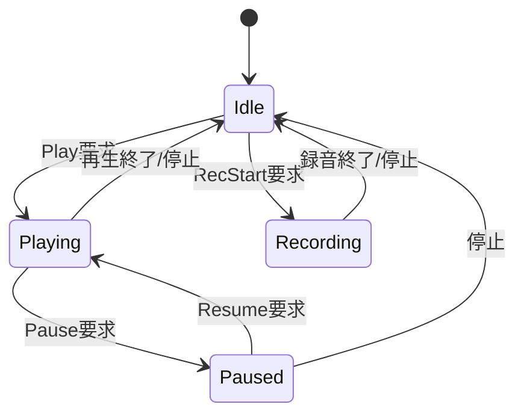

禁止遷移方針:
- `Playing/Paused` 中の録音開始要求は、状態遷移せず無処理（状態維持）。
- `Recording` 中の再生開始要求は、状態遷移せず無処理（状態維持）。

### 6-4. System FSM（Core1）
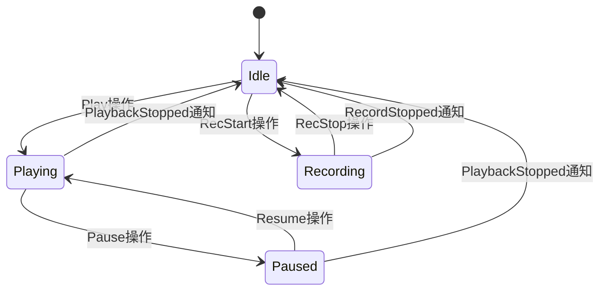

### 6-5. IPC状態（1コマンド単位）
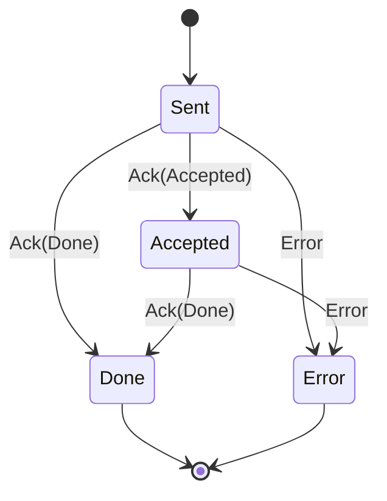

## 7. タスク/割り込み設計

### 7-1. 実行モデル
- ベアメタル
- Core0: `AudioIpcController::Run()` 内で `server.Task()` + `sys.Task()` を反復。
- Core1: `System::Run()` 内で `ipc.PollN()`、touch処理、`lv_timer_handler` を周期実行。
- Audioデータ処理はDMA/Audio Formatterの割り込み駆動。

### 7-2. タスク一覧
| タスク | コア | 周期 | 役割 |
|---------|--------|-------------|------|
| MainLoop-Core0 | Core0 | while(1) | Cmd処理、音声状態機械駆動、状態通知 |
| MainLoop-Core1 | Core1 | while(1) | UI入力処理、IPCイベント処理、LVGL処理 |

### 7-3. 割り込み一覧
| IRQ | IRQシンボル | IRQ ID | 発生源 | コア | 優先度(値) | 処理概要 | 遅延許容 | 禁止事項 |
|-----|-------------|--------|--------|------|-------------|----------|----------|----------|
| Audio Formatter TX IRQ | `XPS_FPGA2_INT_ID` | `63` | Audio Formatter MM2S | Core0 | Normal (0xA0) | 再生側IOC通知、半バッファ更新トリガ | 半バッファ処理予算内（<=256ms） | 重い処理禁止 |
| Audio Formatter RX IRQ | `XPS_FPGA3_INT_ID` | `64` | Audio Formatter S2MM | Core0 | Normal (0xA0) | 録音側IOC通知、半バッファ回収トリガ | 半バッファ処理予算内（<=256ms） | ファイルI/O直実行禁止 |
| I2S RX IRQ | `XPS_FPGA0_INT_ID` | `61` | I2S RX IP | Core0 | Normal (0xA0) | AES block完了/OVF通知 | 同上 | 長時間処理禁止 |
| I2S TX IRQ | `XPS_FPGA1_INT_ID` | `62` | I2S TX IP | Core0 | Normal (0xA0) | AES block完了/UDF通知 | 同上 | 長時間処理禁止 |
| PL I2C IRQ (Core0) | `XPS_FPGA4_INT_ID` | `65` | XIIC_0 | Core0 | Normal (0xA0) | Codec I2C割り込み | 同上 | 長時間処理禁止 |
| PL GPIO IRQ (Core0) | `XPS_FPGA5_INT_ID` | `66` | XGPIO_0 | Core0 | Normal (0xA0) | Board I/O通知 | 同上 | 長時間処理禁止 |
| PL I2C IRQ (Core1) | `XPS_FPGA6_INT_ID` | `67` | XIIC_1 | Core1 | Normal (0xA0) | Touch I2C割り込み | UI周期内 | 長時間処理禁止 |
| GPIO IRQ | `XPS_FPGA7_INT_ID` | `68` | Touch IRQ (PL GPIO) | Core1 | Normal (0xA0) | タッチ割り込み通知、次周期処理へ委譲 | UI周期内 | 長時間処理禁止 |

注記:
- ISRは通知中心、重い処理はメインループ側で処理する。

### 7-4. GIC管理設計
| 項目 | 設計 |
|------|------|
| Distributor初期化 | Core0のみが実施（全体IRQ配線の所有者） |
| CPU Interface初期化 | 各Coreが自Core分を初期化 |
| IRQターゲット設定 | Core0が初期設定し、Core1担当IRQはCore1へルーティング |
| 再初期化方針 | Core1はDistributorを再初期化しない（上書き防止） |
| 運用注記 | 現行は `0xA0` 一律。将来は Audio系を高優先度へ分離予定 |

---

## 8. コア間通信設計

### 8-1. IPC概要
- 通信方式: 共有メモリ（OCM）上のSPSCリング2本。
- メッセージ: 固定長128byte（`MsgHdr` + payload）。
- 同期: ロック機構（mutex/割り込み禁止）を使わないhead/tail更新 + `dmb()` による順序保証。
- 信頼性: Ack（Accepted/Done）とErrorイベントを返す。再送制御は現状アプリ側未実装。

### 8-2. 共有メモリ配置
| 領域 | 配置 | サイズ | キャッシュ | 用途 |
|------|------|--------|------------|------|
| Shared IPC | OCM High `0xFFFC2000` | 96KB予約 | OFF（非キャッシュ） | Cmd/Evtリング |
| CPU1 Vector | `0xFFFFFFF0` | 4B | OFF | Core1起動アドレス受け渡し |
| DMA Buffer | DDR `0x10000000` | 約192KB（現設定） | OFF（非キャッシュ化） | Audio Formatterバッファ |

注記:
- 共有領域は `magic/version` + `cmd ring` + `evt ring` で構成。
- リングサイズは `256 entries`（1 entry=128B、1 ring=32,768B）。

### 8-3. メッセージ仕様

#### 8-3-1. コマンド一覧（Core1→Core0）
| CmdId | 名称 | Payload | 応答(Event) | 備考 |
|------|------|---------|-------------|------|
| `Play` | 再生開始/トグル | `PlayPayload` | `Ack`, `Error`, `PlaybackStatus` | filename指定 |
| `Pause` | 一時停止 | なし | `Ack`, `Error`, `PlaybackStatus` |  |
| `Resume` | 再開 | なし | `Ack`, `Error`, `PlaybackStatus` |  |
| `RecStart` | 録音開始 | `RecStartPayload` | `Ack`, `Error`, `RecordStatus` | Core0側で連番ファイル名化 |
| `RecStop` | 録音停止 | なし | `Ack`, `Error`, `RecordStatus` |  |
| `ListDir` | WAV一覧取得 | `ListDirPayload` | `ResultChunk`, `Ack`, `Error` | 再生/録音中は拒否 |
| `SetAgc` | AGC設定 | `SetAgcPayload` | `Ack`, `Error` | 即時適用 |

#### 8-3-2. イベント一覧（Core0→Core1）
| EvtId | 名称 | Payload | 発行タイミング |
|------|------|---------|----------------|
| `Ack` | 受理/完了通知 | `AckPayload` | 各コマンド受信時/処理完了時 |
| `Error` | エラー通知 | `ErrorPayload` | パラメータ不正/処理失敗時 |
| `ResultChunk` | 分割結果 | `DirEntryPayload` | `ListDir` 応答中 |
| `PlaybackStatus` | 再生状態 | `PlaybackStatusPayload` | 状態変化時 + 定期 |
| `RecordStatus` | 録音状態 | `RecordStatusPayload` | 状態変化時 + 定期 |

### 8-4. シーケンス

再生開始:
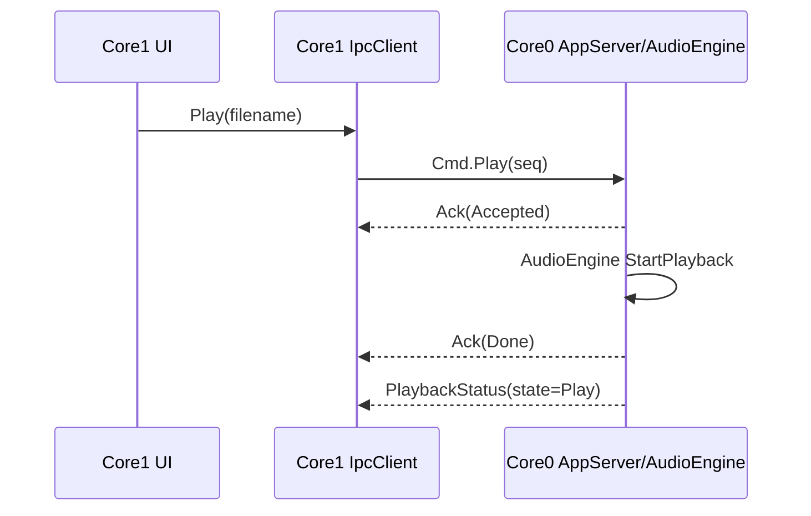

録音開始〜停止:
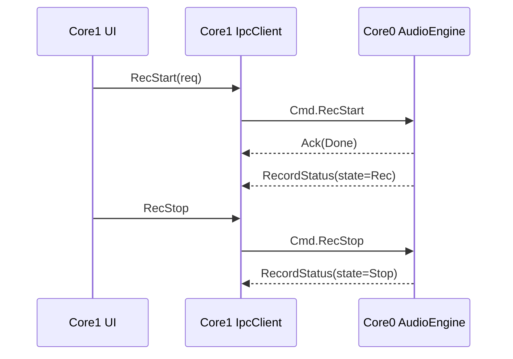

ListDir:
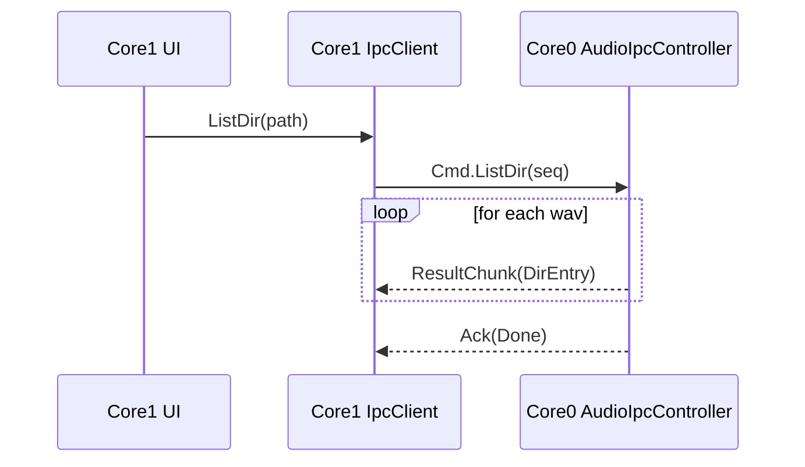

### 8-5. タイムアウト・リトライ方針
- IPCプロトコル上は `seq`/`Ack` を持つが、現状クライアント側の明示的タイムアウト監視は未実装。

### 8-6. 異常系/競合コマンド仕様
| ケース | 現行動作 | 設計上の扱い |
|--------|----------|--------------|
| Playing中にRecStart | Core0 FSMで状態遷移せず無処理 | `Ack(Done)` + 状態不変 |
| Paused中にRecStart | Core0 FSMで状態遷移せず無処理 | `Ack(Done)` + 状態不変 |
| Recording中にPlay | Core0 FSMで状態遷移せず無処理 | `Ack(Done)` + 状態不変 |
| Rec中にListDir | `OnListDir`で拒否（rc<0） | `Error` + `Ack(Done, rc<0)` |
| 未知CmdId | AppServerで拒否 | `Error(code=1)` |
| payload長不一致 | AppServerで拒否 | `Error(code=2)` |
| リング満杯（Push失敗） | `Send()`がfalse（再送なし） | 現状ベストエフォート。将来再送制御追加 |

### 8-7. IPCリング満杯時の扱い（運用ルール）
| 種別 | drop可否 | 現行方針 | 追加運用 |
|------|----------|----------|----------|
| `Ack` | 不可（理想） | Push失敗時は送信失敗 | 失敗カウンタ記録、閾値超過でERRORログ |
| `Error` | 不可（理想） | Push失敗時は送信失敗 | `Ack`同等扱いで優先送信対象 |
| `PlaybackStatus`/`RecordStatus` | 可 | Push失敗時は欠落可 | 次周期で最新状態のみ送信（古い状態は再送しない） |
| `ResultChunk` | 原則不可 | Push失敗時は欠落 | 失敗時は最終Ackを`rc<0`へ変更する方針（将来実装） |

監視ルール:
- 連続送信失敗回数を保持し、しきい値（例: 8回）で `LOGE` を出す。
- しきい値超過中はStatus送信を抑制し、Ack/Error優先を維持する。

### 8-8. エラーコード体系
| code | 意味 | 発生箇所 |
|------|------|----------|
| 1 | Unknown command | IPCサーバ受信処理 |
| 2 | Bad payload length | IPCサーバ受信処理 |
| 100 | Play処理失敗 | `CmdId::Play` |
| 102 | RecStart処理失敗 | `CmdId::RecStart` |
| 103 | RecStop処理失敗 | `CmdId::RecStop` |
| 104 | SetDcCut処理失敗 | `CmdId::SetDcCut` |
| 105 | ListDir処理失敗 | `CmdId::ListDir` |
| 106 | Pause処理失敗 | `CmdId::Pause` |
| 107 | Resume処理失敗 | `CmdId::Resume` |
| 108 | SetAgc処理失敗 | `CmdId::SetAgc` |

### 8-9. Status送信レート設計
- 設計方針:
  - 定期送信は最大5Hz（200ms周期）。
  - 状態遷移時（start/stop/pause/resume）は即時1回送信。
- 目的:
  - evt ring逼迫回避
  - UI更新を十分な粒度で維持

---

## 9. データフロー設計

### 9-1. オーディオデータフロー
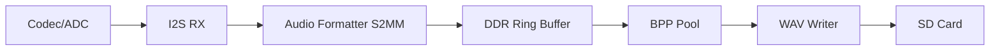

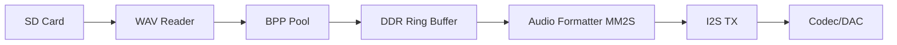

### 9-2. バッファリング方針
- 基本方式: ping-pong + BPPプール。
- 主要定数:
  - periodサイズ = 6144B
  - 1chunkあたりperiod数 = 16
  - 半バッファあたりperiod数 = 8
  - 半バッファサイズ = 49,152B

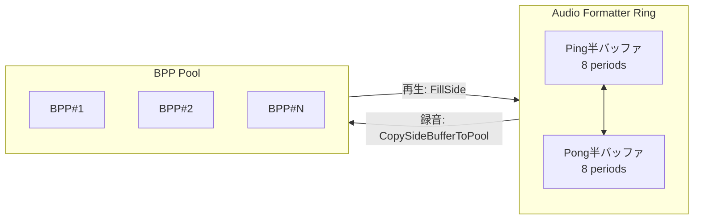

- Overrun/Underrun時:
  - 録音側: RXプール確保失敗をdropとして検知し停止遷移。
  - 再生側: 供給不足時は0埋め継続、終端判定で停止。

### 9-3. オーディオフォーマット制約
| 項目 | 仕様 | 備考 |
|------|----------|------|
| サンプルレート（内部基本） | 48kHz |  |
| チャネル数（内部基本） | 2ch |  |
| 量子化ビット数（内部基本） | 16bit |  |
| WAV読込 | PCMのみ | RIFF/WAVE, PCM(`audio_format==1`) |
| WAVビット深度許容 | 8/16/24/32bit |  |
| エンディアン | little-endian前提 | RIFF/WAVE標準準拠 |

---

## 10. メモリ設計

### 10-1. メモリ使用方針
- OCM: Core間IPCとCPU1ブートベクタ管理。
- DDR: Audio DMAバッファ、BPP関連データ。
- ヒープ: FatFsラッパ（PImpl）など最小限で利用。
- スタック: 各mainループで大規模配列は避ける。

### 10-2. キャッシュ/バリア方針
- OCM共有領域: 1MBセクションを `NORM_NONCACHE` 設定。
- DMAバッファ: 非キャッシュ属性で運用。
- IPCリング更新: `dmb()` を使用して head/tail 公開順序を保証。
- CPU1起動: ブートベクタ書込後 `Xil_DCacheFlushRange` + `dsb`。

副作用と制約:
- OCM High 1MBを非キャッシュ化するため、同領域の汎用データ配置は行わない。
- 性能劣化影響を避けるため、性能クリティカルな一般用途データはDDRへ配置する。

### 10-3. メモリ構成図
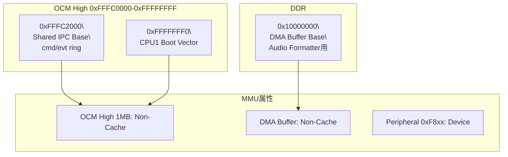

### 10-4. メモリ使用量
| 領域 | 算出式 | 実使用量 | 備考 |
|------|--------|----------|------|
| SharedIpc | `64 + 2*(64 + 256*128)` | 65,728 B | 96KB予約内に収まる |
| SharedIpc余裕 | `98,304 - 65,728` | 32,576 B | 将来拡張余地 |
| DMAバッファ総量 | `pool_bytes + ring_bytes` | 196,608 B | mainで非キャッシュ化 |
| BPP領域 | `6144*16` | 98,304 B | BPP領域 |
| リング領域 | `2*(6144*8)` | 98,304 B | ping/pong半バッファ |
| BPPプール深さ | 16 | 16 BPP | 1BPP=6144B |

注記:
- TX/RXで同一DDRベースを再利用する前提は「再生/録音の同時実行なし」。
- 同時実行導入時はBPP領域分離が必要。

---

## 11. エラー処理設計

### 11-1. エラー分類
| 種別 | 例 | 復旧 |
|------|----|------|
| 致命 | 初期化失敗（GIC/I2S/Pipeline） | 起動中断（main終了） |
| 重大 | SD mount失敗、録音drop、WAV open失敗 | 機能停止＋Error/Ackで通知 |
| 軽微 | 一時的操作不正（状態不一致） | 無視またはLogWarn |

### 11-2. エラー通知（IPC/ログ/UI）
- Core0はErrorイベントをCore1へ通知。
- Core1は `on_error` フックでUI反映可能（現状はログ中心）。
- 再生/録音状態は `PlaybackStatus` / `RecordStatus` を正としてUI表示を更新。

---

## 12. ログ設計

### 12-1. ログレベルと出力先
- レベル: `LOGE/LOGW/LOGI/LOGD`（実装マクロ準拠）。
- 出力先: UART（xil_printf系）。

### 12-2. フォーマット規約
- 目安: `[LEVEL][cpuX] message`
- ISR内は最小限ログに留め、連続出力を避ける。

---

## 13. 性能・リアルタイム要件

### 13-1. 性能目標
| 指標 | 目標 | 測定方法 |
|------|------|----------|
| 録音ドロップ | 0（通常動作） | dropカウンタ/ログ監視 |
| 再生継続性 | 途切れなし | underrunログ監視 + 聴感 |
| UI応答 | 体感100ms以下 | 操作〜アイコン反映計測 |
| IPC応答 | 即時Ack返却 | Ack seqトレース |

### 13-2. ボトルネック候補と対策方針
- SD書き込み/読み出し: BPPプール量と補充budget調整で吸収。
- DMA割り込み頻度: 半バッファ単位処理上限（1tickあたり最大処理数）で負荷制御。
- GUI描画周期: Core1でLVGL周期（既定5ms）とsleep調整。

### 13-3. リアルタイム予算
| 項目 | 算出 | 値 |
|------|------|----|
| データレート | `48,000 * 2ch * 16bit/8` | 192,000 B/s |
| 半バッファサイズ | `6144 * 8` | 49,152 B |
| 半バッファ処理猶予 | `49,152 / 192,000` | 0.256 s (256 ms) |
| BPPプール吸収量 | `6144 * 16` | 98,304 B |
| SD遅延吸収目安 | `98,304 / 192,000` | 0.512 s (512 ms) |

※あくまで理論値なので

### 13-4. ビルドサイズ実測（参考）
| 生成物 | text | data | bss | dec |
|--------|------|------|-----|-----|
| `voice_note_app_amp0.elf` | 346,084 | 3,800 | 2,274,112 | 2,623,996 |
| `voice_note_app_amp1.elf` | 1,088,837 | 3,772 | 2,367,168 | 3,459,777 |

出典:
- `voice_note_app_amp0/build/voice_note_app_amp0.elf.size`
- `voice_note_app_amp1/build/voice_note_app_amp1.elf.size`

---

## 14. 制約・前提・未決事項

### 14-1. 前提条件
- ターゲットは Zynq Cortex-A9 dual-core AMP 構成。
- PL側IP接続およびIRQ割り当ては現行xparameters定義を前提。
- `voice_note_sys` は `voice_note_app_amp0` と `voice_note_app_amp1` の2コンポーネントをロードする。
- Full-Duplex（同時再生/録音）は対象外。

### 14-2. 制約と設計根拠（要点）
| 項目 | 設計値 | 根拠 |
|------|--------|------|
| IPCメッセージサイズ | 128B固定 | OCM上リング管理を単純化し、コピー境界を固定化して実装ミスを減らすため。 |
| IPCリング本数 | Cmd/Evtの2本SPSC | 片方向責務を明確化し、ロック不要で低オーバーヘッド化するため。 |
| Audio periodサイズ | 6144B | `192 samples/AES * 2ch * 16bit = 768B` を8AES束ね、割り込み頻度と処理負荷を両立するため。 |
| chunk構成 | 16periods（半バッファ=8periods） | ping/pong運用と半バッファ処理猶予（約256ms）を確保するため。 |
| OCM/DMA非キャッシュ | OCM high, DDR DMA領域 | DMA/共有メモリの整合性事故を回避するため。 |
| 録音時間上限 | 30秒 | 録音運用の上限を固定し、状態遷移と試験条件を単純化するため。 |
| Full-Duplex対応 | 非対応（同時再生/録音なし） | DDRバッファ再利用前提のため。 |
| OCM High 1MBの用途 | IPC/起動用途専用 | 非キャッシュ化副作用を限定し、意図しない性能劣化を避けるため。 |

### 14-3. スタック設計（暫定）
| 項目 | 想定値 | 備考 |
|------|--------|------|
| Core0 main stack | 16KB | 録再制御・IPC処理向け暫定値 |
| Core1 main stack | 24KB | LVGL/UI処理向け暫定値 |
| IRQ stack | 4KB（各コア） | ISRは軽量処理前提 |

注記:
- 上記は暫定設計値。最終値はmap/実測により更新する。

### 14-4. 未決事項（ToDo）
| ID | 内容 | 期限 | 担当 |
|----|------|------|------|
| TODO-01 | IPCタイムアウト/再送ポリシー定義 | TBD | SW |
| TODO-02 | `Stop`コマンドの運用定義（現状未使用） | TBD | SW |
| TODO-03 | Status送信周期（現実装は毎ループ送信）最適化 | High | SW |
| TODO-04 | Errorコード体系の正式定義とUI表示規約 | TBD | SW/UI |
| TODO-05 | DMA/OCMメモリマップをFPGA設計書と相互参照化 | TBD | SW/FPGA |
| TODO-06 | 各ループ/ISRのstack使用量見積と上限化 | TBD | SW |
